# WordStat

**Word frequency counter [English]**

Paste text or enter URL, get word frequency statistics.

Website: [wordstat.kalba.dev](https://wordstat.kalba.dev)

## Problem

Originally built in 2021 for language learning. I needed to find the most frequent words in technical books to prioritize vocabulary study. Existing tools were either overcomplicated or didn't filter out garbage (typos, code fragments, non-words).

## Solution / Concept

Paste text or URL → get a ranked list of words by frequency. Optional dictionary filter removes non-English words.

```mermaid
flowchart LR
    A[📝 Text / 🔗 URL] --> B[Word Extraction]
    B --> C{Dictionary Filter?}
    C -->|Yes| D[Filter 200k+ words]
    C -->|No| E[Raw frequencies]
    D --> F[📊 Ranked Results]
    E --> F
```



## How it works

1. **Input**: Paste text directly or provide a URL (web page content is fetched and HTML stripped)
2. **Extract**: All words are parsed using English character rules, converted to lowercase
3. **Count**: Each unique word gets a frequency count
4. **Filter** (optional): Non-dictionary words are removed using a 200k+ word list
5. **Rank**: Results sorted by frequency, returned as a ranked list

## Features

📝 **Text analysis**: paste any text, get word frequencies  
🔗 **URL analysis**: fetch and analyze web pages automatically  
📖 **Dictionary filtering**: remove non-English words using 200k+ word dictionary  
⚡ **Interactive UI**: HTMX-powered interface, no page reloads  
🔌 **REST API**: full API with Swagger documentation  

### API Endpoints

| Method | Endpoint | Description |
|--------|----------|-------------|
| POST | `/api/v1/analyze` | Analyze text or URL |
| GET | `/api/v1/analyze?url=...` | Quick URL analysis |
| GET | `/api/v1/health` | Health check |

Swagger UI: `/swagger-ui.html`

```bash
curl -X POST https://wordstat.kalba.dev/api/v1/analyze \
  -H "Content-Type: application/json" \
  -d '{"text": "The quick brown fox", "limit": 10}'
```

## Install / Download

```bash
# Run locally
mvn spring-boot:run

# Or build and run JAR
mvn clean package
java -jar target/wordstat-2.0.0.jar

# Or Docker
docker build -t wordstat .
docker run -p 8080:8080 wordstat
```

Open http://localhost:8080

## Tech

Java 21 • Spring Boot 3.2 • Thymeleaf + HTMX • Tailwind CSS

## History

- **2021**: Original console version for personal language study
- **2025**: Web app with HTMX + REST API

Dictionary source: [gwicks.net/dictionaries.htm](http://www.gwicks.net/dictionaries.htm)

## License

MIT
